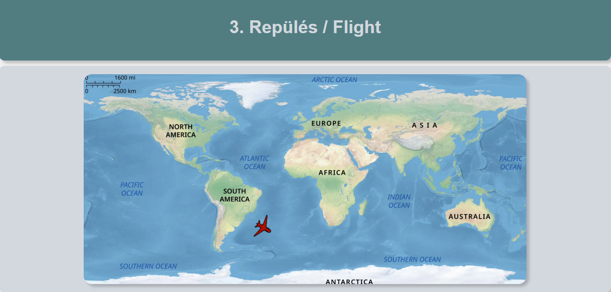

# Flight Canvas Demo

A small interactive **flight simulation exercise** built with **HTML5 Canvas** and **vanilla JavaScript**.

The project allows the user to control a plane using the keyboard, while the aircraft moves smoothly across the canvas, rotates based on its direction, and wraps around the screen edges.

This project demonstrates animation, keyboard input handling, object movement using velocity, and canvas transformations such as translation and rotation.

---

## Preview



---

## 🎮 Play the Game Online

You can play the game directly in your browser without downloading anything:

👉 **[Click here to play](https://jafarhasanli.github.io/flight-canvas/)**

---

## Features

- Plane movement using keyboard controls
- Smooth animation with `requestAnimationFrame`
- Time-based movement using delta time (`dt`)
- Plane rotation based on movement direction
- Screen wrap-around behavior
- Canvas-based rendering

---

## Controls

- **W** — move upward
- **S** — move downward
- **A** — decrease horizontal speed
- **D** — increase horizontal speed

---

## Technologies Used

- **HTML5** — page structure
- **CSS3** — layout and styling
- **JavaScript (ES6)** — logic and interactivity
- **Canvas API** — rendering and transformations
- **requestAnimationFrame** — animation loop

---

## How It Works

The application renders a plane image on an HTML canvas and updates its position continuously based on velocity values.

### Main logic:
- The plane position is updated every frame using `vx`, `vy`, and delta time
- The plane rotates according to its movement direction
- When the plane exits one side of the screen, it reappears on the opposite side
- Keyboard input changes the velocity values in real time

---

## Project Structure

```
flight-canvas
│
├── src/
│   ├── index.css
│   └── task.css
├── screenshots/
│   └── flight-demo.png
├── index.html
├── index.js
├── map.png
├── plane.png
├── TASKS.md
└── README.md
```

---

## Run Locally

No installation is required.

1. Open the project folder
2. Launch `index.html` in your browser

---

## Learning Goals

This project was created to practice:

* HTML Canvas rendering
* JavaScript animation loops
* Delta-time-based movement
* Object rotation using trigonometry
* Keyboard event handling
* Basic 2D game-style mechanics

---

## Possible Future Improvements

* Draw the map as a real background
* Add speed limits
* Add reset functionality
* Add on-screen controls or HUD
* Improve rotation math edge cases
* Add responsive canvas scaling
* Add obstacles or checkpoints

---

## Author

**Jafar Hasanli**
Computer Science Student
Eötvös Loránd University, Budapest

---
